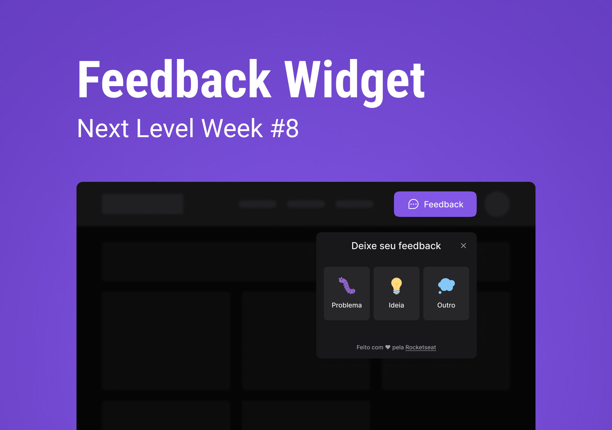

<h1 align="center">
  💬 FeedGet
</h1>



<p align="center">
  
  
  
  
  <a href="https://github.com/amanda-santos/feedget/commits/master">
    
  </a>
  
  <a href="https://github.com/amanda-santos/feedget/issues">
    
  </a>
  
  
</p>

<p align="center">
  <a href="#-about-the-project">About the project</a>&nbsp;&nbsp;&nbsp;|&nbsp;&nbsp;&nbsp;
  <a href="#-technologies">Technologies</a>&nbsp;&nbsp;&nbsp;|&nbsp;&nbsp;&nbsp;
  <a href="#-getting-started">Getting started</a>&nbsp;&nbsp;&nbsp;|&nbsp;&nbsp;&nbsp;
  <a href="#-how-to-contribute">How to contribute</a>&nbsp;&nbsp;&nbsp;|&nbsp;&nbsp;&nbsp;
  <a href="#-license">License</a>
</p>

## 📝 About the project

<p>FeedGet is an app where you can collect bug reports, ideas and thoughts about your application. The users are able to submit detailed feedbacks including a comment and a screenshot of the page and these feedbacks are sent through email to the app admin. 

Developed during Next Level Week #8 Return (Rocketseat).</p>

<code>🚧 Mobile app still under development.</code>

## 👩🏻‍💻 Technologies

Technologies used to develop this project:

<code>Front-end WEB:</code>
- React
- Vite
- TypeScript
- Tailwind
- HTML2Canvas

<code>Back-end:</code>
- Node.js
- TypeScript
- Prisma
- NodeMailer
- Mailtrap
- Postgresql/SQLite

🚢 Deployed through Vercel and Railway.

## ⌨ Getting started

Running the front-end web: 
- Enter the `web` folder
- Run `npm i` to install the dependencies
- Run `npm run dev` to start the server

Running the back-end web: 
- Enter the `server` folder
- Run `npm i` to install the dependencies
- Run `npm run dev` to start the server

## 🖥 Preview


## 🤔 How to contribute

**Make a fork of this repository**

```bash
# Fork using GitHub official command line
# If you don't have the GitHub CLI, use the web site to do that.

$ gh repo fork amanda-santos/feedget
```

**Follow the steps below**

```bash
# Clone your fork
$ git clone your-fork-url && cd feedget

# Create a branch with your feature
$ git checkout -b my-feature

# Make the commit with your changes
$ git commit -m 'feat: My new feature'

# Send the code to your remote branch
$ git push origin my-feature
```

After your pull request is merged, you can delete your branch

---

Made with 💜 by Amanda Santos <br />
